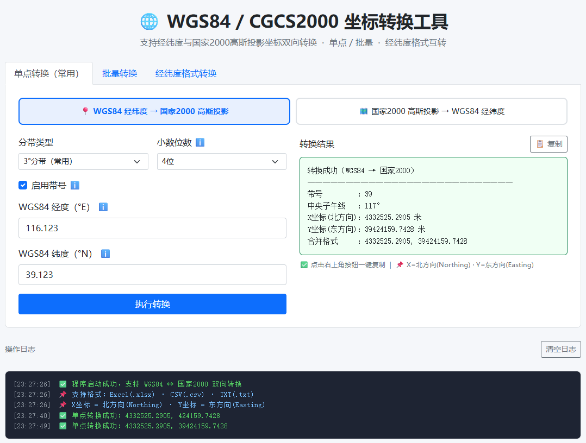

# 🌍 WGS84 / CGCS2000 坐标转换工具

一个开箱即用的 Web 坐标转换服务，支持 **WGS84 ↔ CGCS2000** 双向转换，提供：

- 📍 单点坐标转换
- 📦 批量文件转换（xlsx / csv / txt）
- 📥 模板下载与结果导出
- 🐳 Docker / 群晖 Container Manager 一键部署

## 🖼️ 项目界面预览



---

## 🚀 群晖用户快速开始（可视化部署）

> 目标：用户只改 **端口** 和 **版本**，其余保持默认即可。

### 1) 在群晖创建项目

在 DSM 的 **Container Manager → 项目** 中，新建一个项目目录（例如 `docker/wgs84-cgcs2000`）。

把下面内容保存为 `docker-compose.yml`：

```yaml
services:
  # 🌍 坐标转换服务
  coordinate-converter:
    # 镜像版本：建议使用 latest；如需固定版本可写 v1.1.4
    image: ghcr.io/marod1m/wgs84-cgcs2000:latest

    # 端口映射：左边可改（群晖访问端口），右边 5000 不改
    # 例："12345:5000" 表示访问 http://群晖IP:12345
    ports:
      - "5000:5000"

    # 自动重启：推荐保留
    restart: unless-stopped
```

### 2) 只改两个地方（可选）

- 改端口：把 `5000:5000` 左边改为你想要的端口（如 `12345:5000`）
- 改版本：把 `latest` 改为固定版本（如 `v1.1.4`）

### 3) 点击“下一步/完成”部署

部署成功后在浏览器访问：

- `http://群晖IP:端口`
- 健康检查：`http://群晖IP:端口/healthz`

期望返回：

```json
{"status":"ok"}
```

---

## 💻 Linux / 命令行用户快速开始

### 1) 准备配置

```bash
cp .env.example .env
```

按需修改 `.env`：

```env
APP_PORT=5000
APP_VERSION=latest
```

### 2) 一键启动

```bash
docker compose up -d
```

### 3) 访问服务

- `http://localhost:5000`
- `http://localhost:5000/healthz`

---

## 🧩 两种 Compose 方案说明

### 方案 A：极简版（默认，推荐默认方案）

文件：`docker-compose.yml`

- 只保留必须项，复制即用
- 只需要关心端口和版本

### 方案 B：进阶版（安全与可观测增强）

文件：`docker-compose.full.yml`

启用方式：

```bash
docker compose -f docker-compose.full.yml up -d
```

进阶版额外包含：健康检查、只读根文件系统、`tmpfs /tmp`、`no-new-privileges` 等配置。

---

## 📚 常用命令速查

```bash
# 启动
docker compose up -d

# 查看状态
docker compose ps

# 查看日志
docker compose logs -f

# 拉取新版本并重启
docker compose pull && docker compose up -d

# 停止并删除容器
docker compose down
```

---

## 🔧 主要接口

- `GET /healthz`：健康检查
- `POST /convert_single`：单点转换
- `POST /convert_batch`：批量转换
- `GET /export_template`：模板下载
- `GET /export_results/<filename>`：结果导出

---

## 🛠️ 本地开发测试

```bash
python3 -m venv .venv
.venv/bin/pip install -r requirements.txt pytest
.venv/bin/python -m pytest -q tests
```
